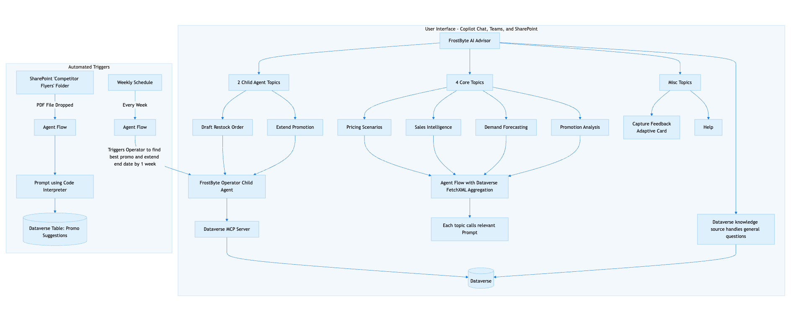

# FrostByte — Brain Freeze Ice Cream AI Solution

FrostByte is an unmanaged Power Platform solution that gives Brain Freeze Ice Cream franchise owners an AI-powered business advisor. It combines two Copilot Studio agents, a custom Dataverse data model, and several Power Automate flows to deliver live sales intelligence, promotion analysis, demand forecasting, and operational write actions — all through a conversational interface.

---

## Getting Started: Import the Solution

### Prerequisites

- A Power Platform environment with Dataverse enabled
- A Copilot Studio license (or Microsoft 365 Copilot license)
- System Administrator or System Customizer role in the target environment
- The Dataverse MCP Server (Preview) connector available in your environment

### Download

Download the unmanaged solution ZIP from this repository:

```
FrostByte_1_0_0_1.zip
```

### Import into Your Environment

1. Go to [make.powerapps.com](https://make.powerapps.com) and select your target environment.
2. In the left navigation, select **Solutions**.
3. Select **Import solution** on the command bar.
4. Click **Browse** and select `FrostByte_1_0_0_1.zip`.
5. Click **Next**, review the solution details, then click **Import**.
6. Wait for the import to complete (this may take a few minutes).

### Post-Import Configuration

After import, the following manual steps are required:

1. **Activate the Cloud Flows** — navigate to **Solutions > FrostByte > Cloud flows** and turn on each flow:
   - Get Pricing Data
   - Get Demand Forecast Data
   - Get Last Quarter Sales
   - Get Promo Metrics
   - Process Competitor Flyer from SharePoint
   - Weekly Promo Review and Extension

2. **Configure connections** — you will be prompted to create or select connections for Dataverse and SharePoint (used by the competitor flyer flow). Ensure these connections authenticate with an account that has read access to your Dataverse environment and the relevant SharePoint site.

3. **Publish the agents** — in Copilot Studio, open the **FrostByte** environment and publish both **FrostByte AI Advisor** and **FrostByte Operator**.

4. **Load sample data** *(optional)* — the custom Dataverse tables are empty after import. Add products, flavors, toppings, tax rates, promotions, and orders to get meaningful responses from the agents.

---

## Solution Overview

### Agents

#### FrostByte AI Advisor

The primary conversational agent for franchise owners. It answers business questions using live Dataverse data and delegates write operations to FrostByte Operator.

| Capability | What it does |
|---|---|
| **Sales Intelligence** | Analyzes sales trends, top-selling products, and revenue by period |
| **Promotion Analysis** | Evaluates promotion performance and ROI; recommends whether to extend or end a promo |
| **Demand Forecasting** | Projects seasonal demand and stocking decisions by flavor |
| **Pricing Scenarios** | Runs what-if pricing calculations including tax-inclusive costs |
| **Extend Promotion** | Delegates to FrostByte Operator to push out a promotion's end date |
| **Draft Restock Order** | Delegates to FrostByte Operator to create a draft restock order in Dataverse |
| **Ad-hoc Data Lookup** | Answers questions about menu items, flavors, toppings, tax rates, and orders using the Dataverse knowledge source |
| **Process Competitor Flyer** | Triggers a flow to extract pricing and offer data from a competitor flyer file in SharePoint |

#### FrostByte Operator

A scoped write agent that performs Dataverse mutations on behalf of FrostByte AI Advisor. It uses the Dataverse MCP Server (Preview) and is restricted to exactly two operations:

- **Extend a promotion** — finds the promotion by name or code and updates its end date
- **Draft a restock order** — creates a new restock order record with Draft status

FrostByte Operator does not perform analysis or data retrieval. All analytical questions are handled by FrostByte AI Advisor.

---

### Data Model

FrostByte installs eight custom Dataverse tables under the `freeze_` prefix:

| Table | Description |
|---|---|
| `freeze_product` | Menu items (cones, sundaes, bowls, shakes, specialties) with size, type, and base price |
| `freeze_flavor` | Ice cream flavors with seasonal availability windows and price modifiers |
| `freeze_topping` | Available toppings with individual pricing and a premium flag |
| `freeze_taxrate` | Jurisdiction-based tax percentages with effective and expiration dates |
| `freeze_promotion` | Active and past promotions with promo codes, discount amounts, and date ranges |
| `freeze_order` | Customer orders with order date, applied tax rate, and applied promotion |
| `freeze_orderitem` | Individual line items on each order, linking a product and flavor with a snapshotted price |
| `freeze_itemtopping` | Individual toppings added to each order item with snapshotted pricing |

Orders → Order Items → Item Toppings form a three-level transaction hierarchy.

---

### Power Automate Flows

| Flow | Purpose |
|---|---|
| **Get Pricing Data** | Retrieves current product and tax rate data for pricing scenario calculations |
| **Get Demand Forecast Data** | Aggregates order history by flavor and period for forecasting |
| **Get Last Quarter Sales** | Returns sales totals and top performers for the prior quarter |
| **Get Promo Metrics** | Computes revenue impact and ROI for active and past promotions |
| **Process Competitor Flyer from SharePoint** | Reads a competitor flyer file from SharePoint and extracts offer data |
| **Weekly Promo Review and Extension** | Scheduled flow that reviews active promotions and triggers the agent to evaluate extension recommendations |

---

## Architecture

```
User
 └── FrostByte AI Advisor (Copilot Studio)
       ├── Dataverse Knowledge Source  ← ad-hoc data lookup
       ├── Power Automate Flows        ← sales, promos, pricing, forecasting
       ├── Process Competitor Flyer    ← SharePoint integration
       └── FrostByte Operator (child agent)
             └── Dataverse MCP Server  ← write operations
```

  
